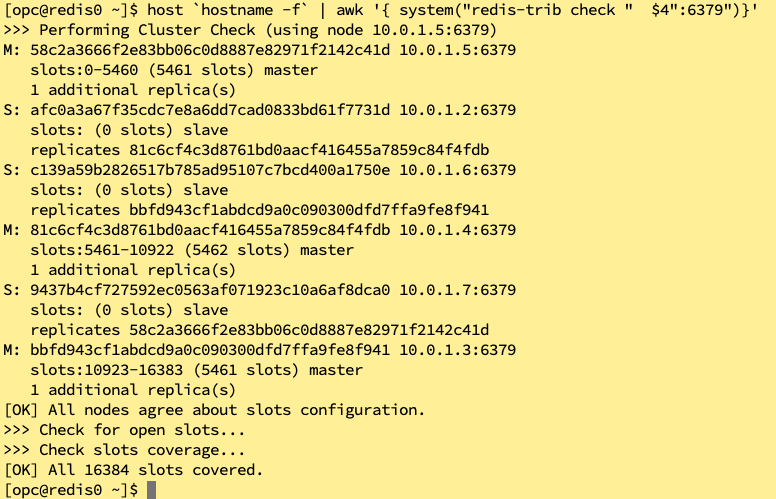

# oci-redis-cluster
这个脚本是为了部署redis-cluster。
原来的https://github.com/oracle-quickstart/oci-redis.git 部署cluster有些问题。作了一些改动。


## 前提条件
需要在OCI上获取一些参数用来terraform与OCI连接。参考： [here](https://github.com/oracle/oci-quickstart-prerequisites).

## 下载terraform脚本
可以通过github上的下载按钮下载到本地解压缩。
也可以通过以下命令行操作：

    git clone https://github.com/ocitiger/oci-redis-cluster.git
    cd oci-redis-cluster/terraform
    ls

## 配置基本参数
当前目录应该是oci-redis-cluster/terraform，该目录下有一个配置文件terraform.tfvars,应该需要配置如下参数，该参数如何获取参见“前提条件”

    tenancy_ocid = "ocid1.tenancy.oc1....."
    user_ocid = "ocid1.user.oc1....."
    fingerprint= "xx:xx:xx:xx:xx:xx:xx:xx:xx:xx:xx:xx:xx:xx:xx:xx"
    private_key_path = "/path/oci_api_key_public.pem"
    region = "ap-seoul-1" # 所在的region
    compartment_ocid = "ocid1.compartment.oc1....."
    ssh_public_key="ssh-rsa AAA... ... xxx@localhost"


## 初始化 Terraform
默认情况下，应该回创建6个node。如果需要修改该值可以`variables.tf`文件中`instance_count`值.
由于redis的cluster最低需要6个node。该值不能低于6。且最好是双数。
当然，这个值可以保持不动。

执行该命令：d to initialize the directory with the module in it.  This makes the module aware of the OCI provider.  You can do this by running:

    terraform init

类似的输出是这样的:


## 建立 Terraform 计划
输入以下命令:

    terraform plan

输出:


## 应用 Terraform 计划
如果以上没有报错，输入以下命令继续:

    terraform apply

You'll need to enter `yes` when prompted.
由于该命令不能撤销，途中会需要提示输入`yes`：  


执行需要一段时间，完成之后类似于这样：


当terraform脚本执行完成，终端出打印出第一台Redis节点的公网IP：您可以通过以下命令登陆：

`ssh -i <the key you used> <public IP of the Redis instance>`

虽然此时terraform脚本执行完成，但是我们用到了cloud-init创建Redis集群，cloud-init脚本需要执行一些类似于yum update的脚本，这需要一些时间，大约15分钟左右。
如果您不着急，可以去喝杯茶，如果实在着急，可以查看第一台Redis节点的/tmp/M.log,看到类似这样的输出代表Redis部署好了:


当Redis成功部署后，可以通过以下脚本来检查redis的cluster是不是正常：

```
host `hostname -f` | awk '{ system("redis-trib check "  $4":6379")}'
```



## 在OCI控制台查看redis节点情况


## 销毁Terraform 资源
如果您不再需要这些Redis资源，可以执行以下脚本删除：

    terraform destroy

由于该命令不能撤销，途中会需要提示输入`yes`：


看到这样的输出就代表此前创建的Redis资源全部被删除了。


